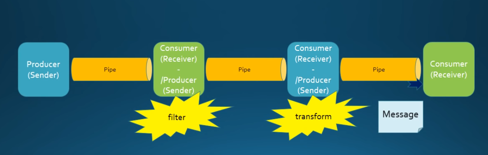

# Spring Integration fb2g(From Beginning To GiveUp)
This is a personal project to show different scenarios in Spring Integration with real code. 

# Main Concept
Messages are exchanged between message endpoints via message channels. 
A message endpoints can have any number of (even zero) input and output message channels. 

When a message endpoint consumes messages from a message channel: 
* **poll/active** - *actively read them*
* **listen/passive** - *passively receive them*

Message channels: 
* **direct channel** - *pass through messages*
* **queue channel** - *temporarily store them in memory*

Message Endpoint Direction: 
* **bidirectional** - *request-response nature*
* **unidirectional** - *fire-and-forget nature*

Message Endpoint Placement:
* **input** - Connects SI flow to upstream external application or internal Java logic
* **output** - Connects SI flow to downstream external application or internal Java logic
* **middle** - This component can participate in unidirectional or bidirectional flow

Message Endpoint Purpose:
* **generic** - Maps the message channel to the java interface or class 
* **technology-specific** - Connects SI flow to an external system or transport protocol 

List of Message Endpoints:

| Endpoint Name | Unidirectional | Bidirectional | Input | Output | Middle | Poll | Listen | Generic | Specific |
| --- | :---: | :---: | :---: | :---: | :---: | :---: | :---: | :---: | :---: |

* **Channel Adapter** - unidirectional, input/output, poll/listen, generic/tech-specific
* **Service Activator** - unidirectional/bidirectional, output/middle, poll/listen, generic
* **Gateway** - unidirectional/bidirectional, output/middle, listen, generic/tech-specific
* **Transformer** - unidirectional/bidirectional, **middle**, poll/listen, generic/tech-specific
* **Content Enricher** - unidirectional/bidirectional, **middle**, poll/listen, generic/tech-specific
* **Filter** - unidirectional/bidirectional, **middle**, poll/listen, generic/tech-specific
* **Router** - unidirectional/bidirectional, **middle**, listen, generic/tech-specific
* **Bridge** - unidirectional/bidirectional, **middle**, poll/listen, generic
* **Chain** - unidirectional/bidirectional, **middle**, listen, generic
* **Splitter** - unidirectional/bidirectional, **middle**, poll/listen, generic/tech-specific
* **Aggregator** - unidirectional/bidirectional, **middle**, listen, generic

:white_check_mark:
:x:

 
