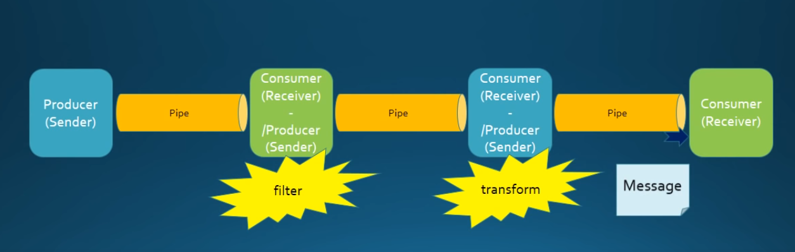
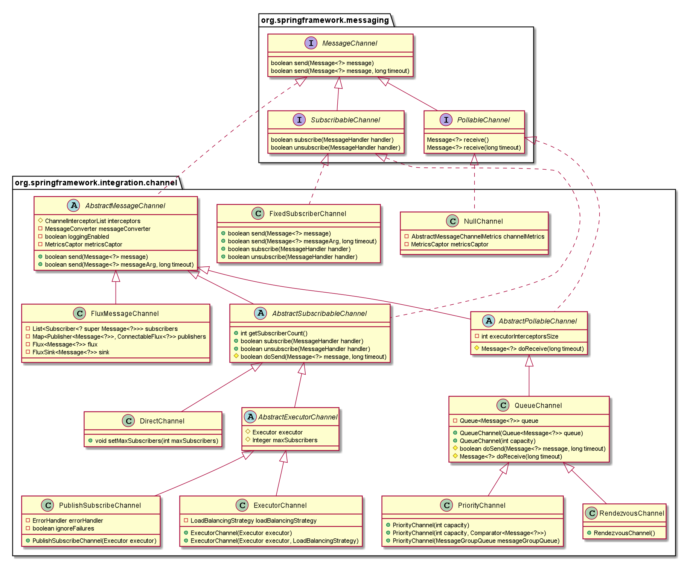

# Spring Integration fb2g(From Beginning To GiveUp)
This is a personal project to show different scenarios in Spring Integration with real code. 

# Main Concept
Messages are exchanged between message endpoints via message channels. 


## Message Endpoint
A message endpoints can have any number of (even zero) input and output message channels. 

When a message endpoint consumes messages from a message channel: 
* **poll/active** - *actively read them*
* **listen/passive** - *passively receive them*

Message Endpoint Direction: 
* **bidirectional** - *request-response nature*
* **unidirectional** - *fire-and-forget nature*

Message Endpoint Placement:
* **input** - Connects SI flow to upstream external application or internal Java logic
* **output** - Connects SI flow to downstream external application or internal Java logic
* **middle** - This component can participate in unidirectional or bidirectional flow

Message Endpoint Purpose:
* **generic** - Maps the message channel to the java interface or class 
* **technology-specific** - Connects SI flow to an external system or transport protocol 

List of Message Endpoints:

| Endpoint Type | Unidirec | Bidirec | Input | Output | Middle | Poll | Listen | Generic | Specific |
| --- | :---: | :---: | :---: | :---: | :---: | :---: | :---: | :---: | :---: |
| **Channel Adapter** | :white_check_mark: | :x: | :white_check_mark: | :white_check_mark: | :x: | :white_check_mark: | :white_check_mark: | :white_check_mark: | :white_check_mark: |
| **Service Activator** | :white_check_mark: | :white_check_mark: | :x: | :white_check_mark: | :white_check_mark: | :white_check_mark: | :white_check_mark: | :white_check_mark: | :x: |
| **Gateway** | :white_check_mark: | :white_check_mark: | :white_check_mark: | :white_check_mark: | :x: | :x: | :white_check_mark: | :white_check_mark: | :white_check_mark: |
| **Transformer** | :white_check_mark: | :white_check_mark: | :x: | :x: | :white_check_mark: | :white_check_mark: | :white_check_mark: | :white_check_mark: | :white_check_mark: |
| **Content Enricher** | :white_check_mark: | :white_check_mark: | :x: | :x: | :white_check_mark: | :white_check_mark: | :white_check_mark: | :white_check_mark: | :white_check_mark: |
| **Filter** | :white_check_mark: | :white_check_mark: | :x: | :x: | :white_check_mark: | :white_check_mark: | :white_check_mark: | :white_check_mark: | :white_check_mark: |
| **Router** | :white_check_mark: | :white_check_mark: | :x: | :x: | :white_check_mark: | :x: | :white_check_mark: | :white_check_mark: | :white_check_mark: |
| **Bridge** | :white_check_mark: | :white_check_mark: | :x: | :x: | :white_check_mark: | :white_check_mark: | :white_check_mark: | :white_check_mark: | :x: |
| **Chain** | :white_check_mark: | :white_check_mark: | :x: | :x: | :white_check_mark: | :x: | :white_check_mark: | :white_check_mark: | :x: |
| **Splitter** | :white_check_mark: | :white_check_mark: | :x: | :x: | :white_check_mark: | :white_check_mark: | :white_check_mark: | :white_check_mark: | :white_check_mark: |
| **Aggregator** | :white_check_mark: | :white_check_mark: | :x: | :x: | :white_check_mark: | :x: | :white_check_mark: | :white_check_mark: | :x: |

* **Channel Adapter** - unidirectional, input/output, poll/listen, generic/tech-specific
* **Service Activator** - unidirectional/bidirectional, output/middle, poll/listen, generic
* **Gateway** - unidirectional/bidirectional, input/output, listen, generic/tech-specific
* **Transformer** - unidirectional/bidirectional, **middle**, poll/listen, generic/tech-specific
* **Content Enricher** - unidirectional/bidirectional, **middle**, poll/listen, generic/tech-specific
* **Filter** - unidirectional/bidirectional, **middle**, poll/listen, generic/tech-specific
* **Router** - unidirectional/bidirectional, **middle**, listen, generic/tech-specific
* **Bridge** - unidirectional/bidirectional, **middle**, poll/listen, generic
* **Chain** - unidirectional/bidirectional, **middle**, listen, generic
* **Splitter** - unidirectional/bidirectional, **middle**, poll/listen, generic/tech-specific
* **Aggregator** - unidirectional/bidirectional, **middle**, listen, generic

## Message Channel
**Message Channel Type:**
* **point-to-point channel** - Each message is consumed by exactly one endpoint.  
* **publish/subscribe channel** - Each message is sent to all subscribed consumers. 

**SI 5.1.7 Message Channel inheritance structure**


**Message Channel Async:**

| Channel Type | Sync | Async | P2P | Pub/Sub | 
| --- | :---: | :---: | :---: | :---: |
| **Direct Channel** | :white_check_mark: | :x: | :white_check_mark: | :x: |
| **Queue Channel** | :x: | :white_check_mark: | :white_check_mark: | :x: |
| **Priority Channel** | :x: | :white_check_mark: | :white_check_mark: | :x: |
| **Executor Channel** | :x: | :white_check_mark: | :white_check_mark: | :x: |
| **Rendezvous Channel** | :white_check_mark: | :white_check_mark: | :white_check_mark: | :x: |
| **PublishSubscribe Channel** | :white_check_mark: | :white_check_mark: | :x: | :white_check_mark: |

**Message Channel ShowCase**

**Direct Channel**
```xml
<int:channel>
</int:channel>
```

**Queue Channel**
```xml
<int:channel>
    <int:queue capacity="10"/>
</int:channel>
```

**Priority Channel**
```xml
<int:channel>
    <int:priority-queue capacity="10" comparator="CustomBean"/>
</int:channel>
```

**Rendezvous Channel**
```xml
<int:channel>
    <int:renderzvous-queue />
</int:channel>
```

**Executor Channel**
```xml
<int:channel>
    <int:dispatcher task-executor="executor" />
</int:channel>
```

**PublishSubscribeChannel Sync**
```xml
<int:publish-subscribe-channel/>
```

**PublishSubscribeChannel ASync**
```xml
<int:publish-subscribe-channel task-executor="executor" />
```

