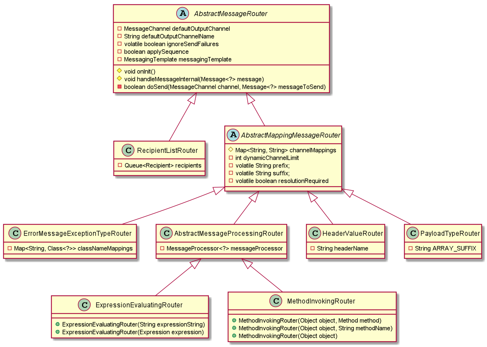

## List of Router Channel
* **Generic Router**
* **Payload Type Router**
* **Header Value Router**
* **Recipient List Router**
* **XPath Router**
* **Error Message Exception Type Router**

###Router Channel Show Case
**Payload Type Router**
```xml
<int:payload-type-router input-channel="routingChannel">
    <int:mapping type="java.lang.String" channel="stringChannel" />
    <int:mapping type="java.lang.Integer" channel="integerChannel" />
</int:payload-type-router>
```

###SI 5.1.7 Router inheritance structure


###Router Configuration Attributes Outside Chain

| Attribute | Generic <br> Router | Header Value <br> Router | XPath <br> Router | Payload Type <br> Router | Recipient List <br>Router | Exception Type <br> Router |
| --- | :---: | :---: | :---: | :---: | :---: | :---: |
| apply-sequence | :white_check_mark: | :white_check_mark: | :white_check_mark: | :white_check_mark: | :white_check_mark: | :white_check_mark: | 
| default-output-channel | :white_check_mark: | :white_check_mark: | :white_check_mark: | :white_check_mark: | :white_check_mark: | :white_check_mark: | 
| resolution-required | :white_check_mark: | :white_check_mark: | :white_check_mark: | :white_check_mark: | :white_check_mark: | :white_check_mark: | 
| ignore-send-failures | :white_check_mark: | :white_check_mark: | :white_check_mark: | :white_check_mark: | :white_check_mark: | :white_check_mark: | 
| timeout | :white_check_mark: | :white_check_mark: | :white_check_mark: | :white_check_mark: | :white_check_mark: | :white_check_mark: | 
| id | :white_check_mark: | :white_check_mark: | :white_check_mark: | :white_check_mark: | :white_check_mark: | :white_check_mark: | 
| auto-standup | :white_check_mark: | :white_check_mark: | :white_check_mark: | :white_check_mark: | :white_check_mark: | :white_check_mark: | 
| input-channel | :white_check_mark: | :white_check_mark: | :white_check_mark: | :white_check_mark: | :white_check_mark: | :white_check_mark: | 
| order | :white_check_mark: | :white_check_mark: | :white_check_mark: | :white_check_mark: | :white_check_mark: | :white_check_mark: | 
| method | :white_check_mark: | :x: | :x: | :x: | :x: | :x: | 
| ref | :white_check_mark: | :x: | :x: | :x: | :x: | :x: | 
| expression | :white_check_mark: | :x: | :x: | :x: | :x: | :x: | 
| header-name | :x: | :white_check_mark: | :x: | :x: | :x: | :x: | 
| evaluate-as-string | :x: | :x: | :white_check_mark: | :x: | :x: | :x: | 
| xpath-expression-ref | :x: | :x: | :white_check_mark: | :x: | :x: | :x: | 
| converter | :x: | :x: | :white_check_mark: | :x: | :x: | :x: | 


###Router Configuration Attributes Inside Chain

| Attribute | Generic <br> Router | Header Value <br> Router | XPath <br> Router | Payload Type <br> Router | Recipient List <br>Router | Exception Type <br> Router |
| --- | :---: | :---: | :---: | :---: | :---: | :---: |
| apply-sequence | :white_check_mark: | :white_check_mark: | :white_check_mark: | :white_check_mark: | :white_check_mark: | :white_check_mark: | 
| default-output-channel | :white_check_mark: | :white_check_mark: | :white_check_mark: | :white_check_mark: | :white_check_mark: | :white_check_mark: | 
| resolution-required | :white_check_mark: | :white_check_mark: | :white_check_mark: | :white_check_mark: | :white_check_mark: | :white_check_mark: | 
| ignore-send-failures | :white_check_mark: | :white_check_mark: | :white_check_mark: | :white_check_mark: | :white_check_mark: | :white_check_mark: | 
| timeout | :white_check_mark: | :white_check_mark: | :white_check_mark: | :white_check_mark: | :white_check_mark: | :white_check_mark: | 
| id | :x: | :x: | :x: | :x: | :x: | :x: | 
| auto-standup | :x: | :x: | :x: | :x: | :x: | :x: | 
| input-channel | :x: | :x: | :x: | :x: | :x: | :x: | 
| order | :x: | :x: | :x: | :x: | :x: | :x: | 
| method | :white_check_mark: | :x: | :x: | :x: | :x: | :x: | 
| ref | :white_check_mark: | :x: | :x: | :x: | :x: | :x: | 
| expression | :white_check_mark: | :x: | :x: | :x: | :x: | :x: | 
| header-name | :x: | :white_check_mark: | :x: | :x: | :x: | :x: | 
| evaluate-as-string | :x: | :x: | :white_check_mark: | :x: | :x: | :x: | 
| xpath-expression-ref | :x: | :x: | :white_check_mark: | :x: | :x: | :x: | 
| converter | :x: | :x: | :white_check_mark: | :x: | :x: | :x: | 


